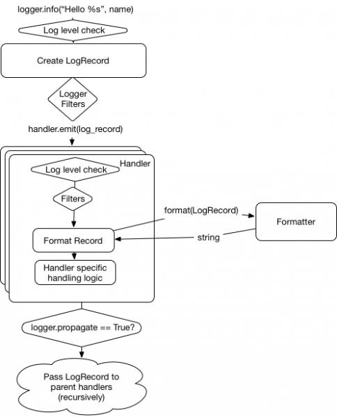

# Loguru
해당 프로젝트의 목적은 로깅 loguru의 익히기 위한 목적으로 한다.


## Prerequisitive
```shell
$ PIPENV_VENV_IN_PROJECT=true pipenv install --three
```

```shell
$ pipenv install
```

## Getting Started

### Logging How to work
로깅을 어떻게 동작할까? 아래 그림을 통하여 확인 할 수 있다.



- Level: 로깅 정보의 중요도를 나타낸다.
    ```python
    logger.info("info level")
    ```

- Filter: 로깅매칭하는 경우 로깅에 대한 추가
    ```txt
    "password": "1234" ---> "password": "비밀번호처리"
    ```

- Formatting: 어떤 형태로 출력할 것인가?
    ```python
    logging.Formatter('%(asctime)s - %(name)s - %(levelname)s - %(message)s')
    ```

- Handler: 어디에다가 정보를 출력할 것인가?
    ```python
    # 콘솔, 파일,DB,소켓, 큐 등으로  출력
    file_handler = logging.FileHandler('my.log')
    mylogger.addHandler(file_handler)
    ```

### 사용방법

- Rotation & Compression
    ```python
    logger.add("file_1.log", rotation="500 MB")    # Automatically rotate too big file
    logger.add("file_2.log", rotation="12:00")     # New file is created each day at noon
    logger.add("file_3.log", rotation="1 week")    # Once the file is too old, it's rotated

    logger.add("file_X.log", retention="10 days")  # Cleanup after some time

    logger.add("file_Y.log", compression="zip")    # Save some loved space
    ```

- Formatting
    ```python
    logger.info("If you're using Python {}, prefer {feature} of course!", 3.6, feature="f-strings")
    ```
- Multi-Process
    ```python
    logger.add("somefile.log", enqueue=True)
    ```
### 무엇을 로깅할 것인가?
- 서비스가 살았는지 죽었는지 생사여부를 알려주세요 - 동작 상태 파악
- 서비스가 혹시 문제가 생겼나요? 알려주세요. - 장애 파악 & 알람
- 서비스가 남겨야 하는 로그를 알려주세요. - 지표 및 데이터 외부 저장 시 


### 어떻게 남길 것인가?
배포 환경에 알맞은 로깅 레벨을 설정하여 해당 레벨에 맞춰서 남겨주세요.


## Reference
- [python logging](https://kimeuichan.github.io/posts/python-logging-with-loguru/)
- [loguru](https://loguru.readthedocs.io/en/stable/)
- [loguru for blog](https://kimeuichan.github.io/posts/python-logging-with-loguru/)
- [logging howto](https://docs.python.org/3.7/howto/logging.html)
- [python-logging](https://opensource.com/article/17/9/python-logging)
